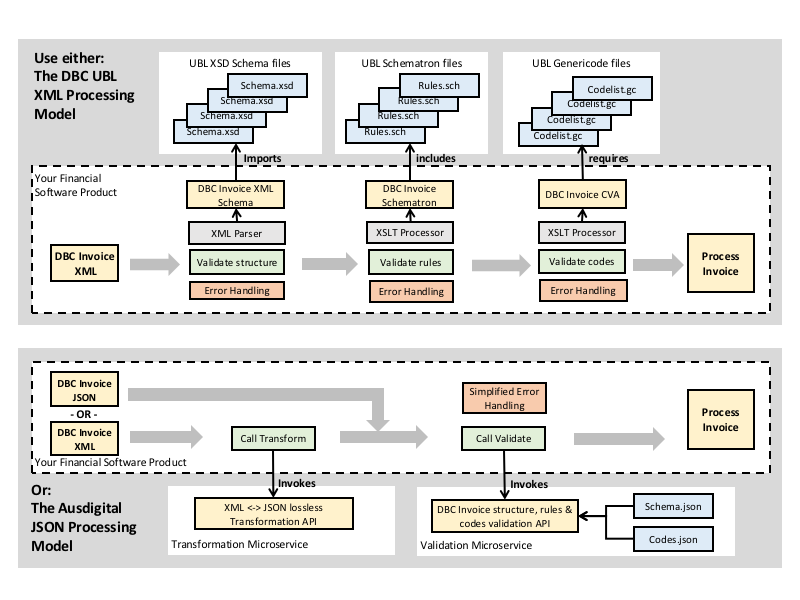

**[Back to AusDigital.org](http://ausdigital.org/)**

# JSON Syntax

## DBC JSON Syntax Specification

 * 
 * Editor: Steve Capell
 * Contributors: 

This document describes a JSON based syntax and processing model for UBL semantics. It includes
* A simple JSON syntax model for UBL semantics.
* A lossless transformation model between UBL XML and JSON representations.
* A simple JSON processing model based on a RESTful Validation API 

The intent is to provide developers with a much simpler implementation model than the XSD/Schematron/Genericode alternative whilst maintianing interoperability with the UBL XML standard.

This Specification

 * can be applied equally to any UBL document (this invoice is just the first) and so is maintained as a separate specification.
 * exists to support the Digital Business Council [e-Invoicing initiative](https://ausdigital.github.io), and is under active development at [https://github.com/ausdigital/ausdigital-json](https://github.com/ausdigital/ausdigital-json).

## Introduction

Widespread adoption of the e-invoicing framework depends on the provision of clear, unambiguous and simple specifications that are developer freindly and impose very low implementation costs.  

As shown in the diagram below, the standard UBL XSD/Schemmatron/Genericode processing model imposes significant complexity burdens on implementers.  An alternative REST/JSON microservices model reduces implementation cost and complexity to a near zero minimum.

e-Invoicing implementers can choose whether to consume third party transformation & validation services or whether to build their own microservices based on this specification.

## Licence

Copyright (c) 2016 the Editor and Contributors. All rights reserved.

This Specification is free software; you can redistribute it and/or modify it under the terms of the GNU General Public License as published by the Free Software Foundation; either version 3 of the License, or (at your option) any later version.

This Specification is distributed in the hope that it will be useful, but WITHOUT ANY WARRANTY; without even the implied warranty of MERCHANTABILITY or FITNESS FOR A PARTICULAR PURPOSE. See the GNU General Public License for more details.

You should have received a copy of the GNU General Public License along with this program; if not, see [http://www.gnu.org/licenses](http://www.gnu.org/licenses).

## Change Process

This document is governed by the [2/COSS](http://rfc.unprotocols.org/spec:2/COSS/) (COSS).

## Language

The key words "MUST", "MUST NOT", "REQUIRED", "SHALL", "SHALL NOT", "SHOULD", "SHOULD NOT", "RECOMMENDED", "MAY", and "OPTIONAL" in this document are to be interpreted as described in RFC 2119.

